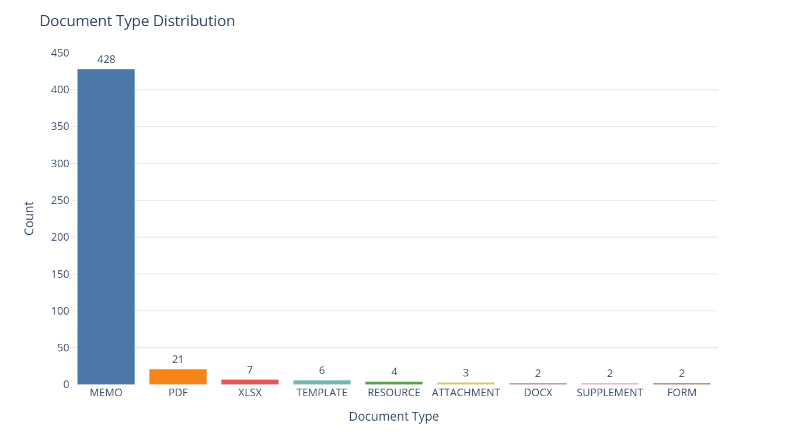
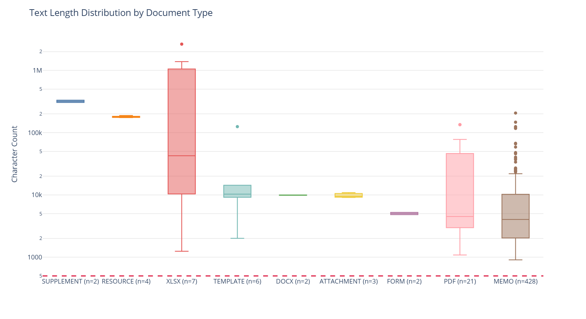
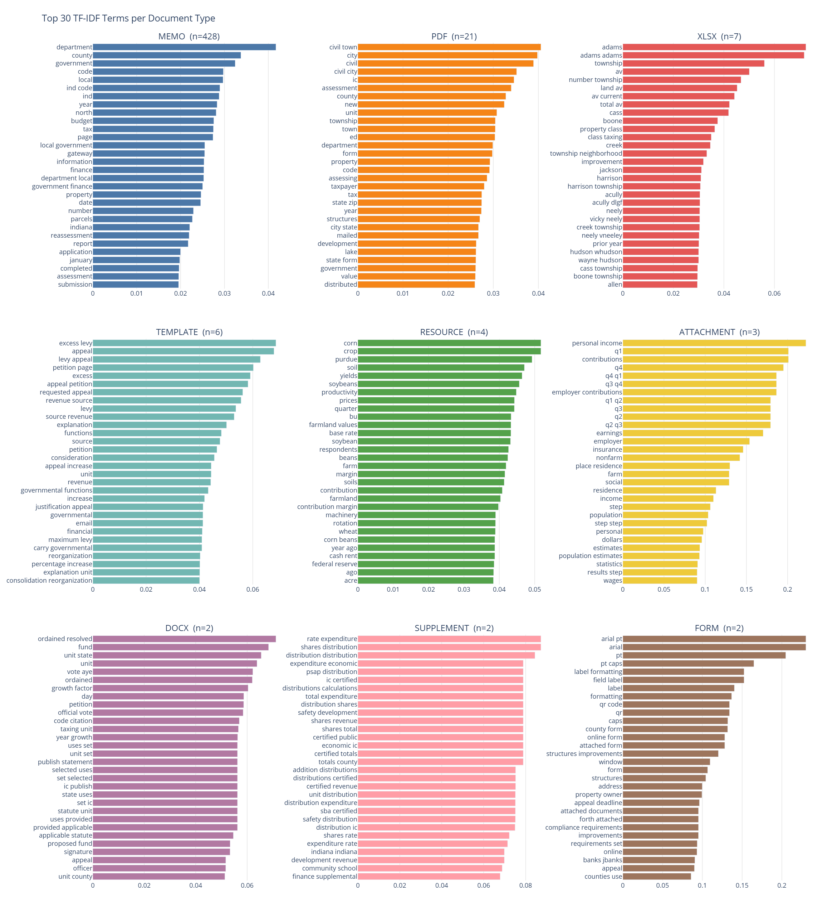
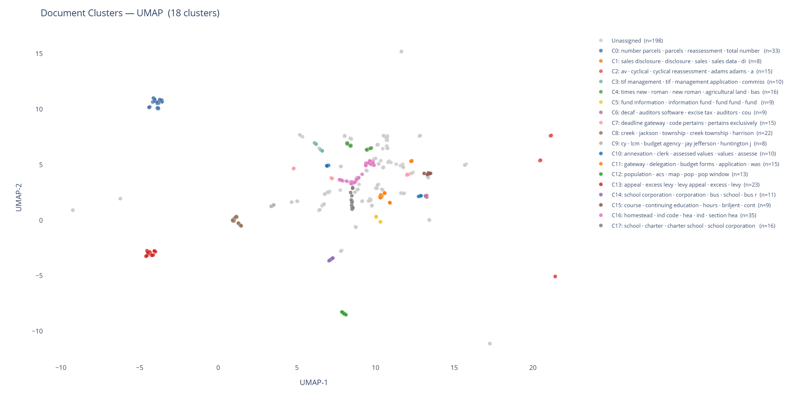

# DLGF Memo Intelligence Pipeline

A pipeline for collecting, extracting, analyzing, and querying the Indiana Department of Local Government Finance (DLGF) memo corpus -- five years of official guidance documents covering property assessment, local budgeting, tax caps, TIF districts, and more.

The end goal is a LangGraph-powered assistant with a web UI that can answer questions, summarize documents, and surface trends across the memo archive.

---

## Data Source

**Indiana DLGF Memos (2022-2026)**
`https://www.in.gov/dlgf/memos-and-presentations/memos/`

479 documents collected across five annual pages. Documents are a mix of PDFs (memos, guidance, reports), Word documents (templates, petitions), and Excel files (levy calculation worksheets, data submissions). Text extraction yielded 475 usable documents -- 10.2 million characters total.

---

## Pipeline

| Step | Script | Output |
|------|--------|--------|
| 1. Collect & download | `get_docs.py` | `docs/<year>/` + `metadata.json` |
| 2. Extract text | `ingest.py` | `documents.parquet` |
| 3. Explore | `explore.py` | `eda/` (charts + flagged docs) |
| 4. Topic modeling | `document_clustering.py` | cluster columns in parquet + `cluster_summary.csv` |
| 5. Index | *next* | vector database |
| 6. Query | *next* | RAG + LangGraph + UI |

### `get_docs.py`
Scrapes all five year pages, extracts document links, downloads each file, and writes a `metadata.json` manifest. Parses DLGF filename conventions (`YYMMDD-Author-DocType-Title.pdf`) to extract date, author, semantic type, and title. Includes a polite crawl delay and skips files already on disk.

### `ingest.py`
Reads `metadata.json` and extracts text from each downloaded file:
- **PDF** -- `pdfplumber`, page text joined with double newlines
- **DOCX** -- `python-docx`, paragraphs + table cells
- **XLSX** -- `openpyxl`, per-sheet blocks with tab-separated cells

Outputs `documents.parquet` with columns: `doc_id`, `source`, `doc_type`, `text`, `char_count`, `retrieved_at`.

### `explore.py`
Exploratory analysis of the parquet. Produces four outputs in `eda/`, each saved as interactive HTML and static PNG. TF-IDF uses a custom token pattern to exclude pure numbers and underscore artifacts from scanned form templates.

### `document_clustering.py`
Clusters documents by topic using TF-IDF + SVD embeddings and HDBSCAN. No need to specify the number of clusters -- HDBSCAN finds natural density-based groupings, leaving genuinely ambiguous documents unassigned rather than forcing them into a cluster. Reduces to 2D with UMAP for visualization. Adds `cluster_id` and `cluster_label` to both `documents.parquet` and `metadata.json`, and writes `cluster_summary.csv` with per-cluster doc counts, type breakdowns, top terms, and date ranges.

---

## EDA & Clustering Highlights

### Document type distribution

The corpus is overwhelmingly memos (428 of 475). The remaining documents are templates, Excel attachments, and supplemental resources. The `PDF`/`DOCX`/`XLSX` fallback types are files whose names do not follow the standard DLGF naming convention.



### Text length by type

Log-scale box plots reveal a heavily right-skewed distribution. The median document is ~4,500 characters; the mean is ~21,000 characters, pulled up by large Excel worksheets (one XLSX tops 2.6 million characters). No documents fell below the 500-character usefulness threshold -- extraction quality is clean across all file types.



### TF-IDF top terms per document type

Cross-corpus TF-IDF (averaged per document type) surfaces vocabulary that is distinctive to each type -- not just common, but common *relative to the rest of the corpus*. The signal is clear:

- **MEMO** -- `ind code`, `county`, `local government`, `tax` -- statutory/administrative guidance
- **TEMPLATE** -- `excess levy`, `appeal petition`, `levy appeal` -- structured form language
- **ATTACHMENT** -- `personal income`, `employer`, `contributions`, `nonfarm` -- economic data inputs

That separation across types means a simple classifier will likely work well, and retrieval-augmented generation will be able to distinguish document intent before answering a query.



### Topic clusters

18 topics discovered across 475 documents using HDBSCAN on TF-IDF + SVD embeddings, projected to 2D with UMAP. Selected highlights:

| Cluster | Top terms | Docs | What it covers |
|---------|-----------|------|----------------|
| C16 | homestead, ind code, hea | 35 | Homestead deduction legislation and guidance |
| C0  | reassessment, parcels, total number | 33 | Cyclical reassessment monthly status reports |
| C13 | excess levy, appeal, petition | 23 | Levy appeal process -- memos and petition templates cluster together |
| C17 | charter school, governing body | 16 | Charter school governance memos |
| C2  | av, cyclical reassessment | 15 | Assessed value and reassessment methodology |
| C7  | deadline, gateway, code pertains | 15 | Gateway portal submission deadlines |
| C14 | school corporation, bus replacement | 11 | School transportation and capital planning |
| C3  | tif management, commission | 10 | TIF district management |
| C15 | continuing education, hours | 9 | Assessor CE requirements and course listings |

One notable signal: C13 pulls together both MEMO and TEMPLATE documents on the same topic (excess levy appeals), confirming that the semantic clusters cut across document types rather than just recapitulating them. That cross-type coherence is what makes these clusters useful for retrieval -- a query about levy appeals will surface both the policy memo and the petition template.

41.7% of documents are currently unassigned. This is HDBSCAN being conservative -- it leaves ambiguous documents out rather than forcing them into weak clusters. Cluster parameters are being tuned.



---

## What is Next

**Vector database**
Chunk the parquet text, embed with a sentence transformer or OpenAI embeddings, and load into a vector store (Chroma or Pinecone). Metadata -- date, author, doc_type, cluster_id -- becomes filterable at retrieval time.

**RAG pipeline**
Retrieve the top-k most relevant chunks for a query, pass them to an LLM with a grounded prompt. Starting point: question answering over specific memos. Extend to multi-document summarization and trend extraction.

**LangGraph system**
A multi-node graph that routes queries to the right tool -- semantic search, document Q&A, summarization, or trend analysis -- based on query intent. Nodes can call each other, enabling complex chains like "find all 2024 memos about excess levy appeals, then summarize the key changes."

**UI**
A lightweight web interface on top of the LangGraph agent. Target capabilities:
- Natural language search over the full corpus
- Ask a question, get an answer with source citations
- Summarize a document or a cluster of related documents
- "What changed between 2022 and 2026 on topic X?" trend queries

---

## Setup

```bash
pip install -r requirements.txt

# 1. Download documents (writes docs/ and metadata.json)
python get_docs.py

# 2. Extract text (writes documents.parquet)
python ingest.py

# 3. Explore (writes eda/)
python explore.py

# 4. Cluster by topic (updates parquet + metadata.json, writes cluster_summary.csv and eda/clusters_*.{html,png})
python document_clustering.py
```

Requires Python 3.10+. PNG export requires `kaleido`; HTML files are always written as a fallback. UMAP is used for 2D projection if `umap-learn` is installed; otherwise falls back to PCA.

---

## Project Structure

```
.
|-- get_docs.py                # Document collection and download
|-- ingest.py                  # Text extraction -> parquet
|-- explore.py                 # EDA charts and flagging
|-- document_clustering.py     # Topic modeling and cluster visualization
|-- requirements.txt
|-- metadata.json              # Per-file metadata manifest (includes cluster assignments)
|-- documents.parquet          # Extracted text corpus (includes cluster assignments)
|-- cluster_summary.csv        # Per-cluster stats and top terms
|-- docs/
|   |-- 2022/
|   |-- 2023/
|   |-- 2024/
|   |-- 2025/
|   `-- 2026/
`-- eda/
    |-- doc_type_distribution.{html,png}
    |-- text_length_by_type.{html,png}
    |-- tfidf_top_terms.{html,png}
    |-- clusters_scatter.{html,png}
    |-- clusters_by_doctype.{html,png}
    `-- short_docs_flagged.csv
```